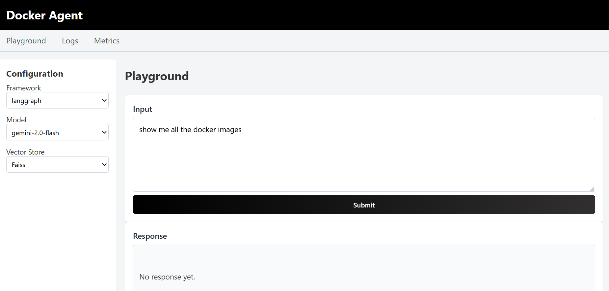

[](https://github.com/langchain-ai/langgraph)
[](https://github.com/microsoft/autogen)
[](https://www.llamaindex.ai/)
[](https://stanfordnlp.github.io/dspy/)
[](https://openai.com/)
[](https://openai.com/)
[](https://openai.com/)
[](https://ai.meta.com/llama/)
[](https://ai.meta.com/llama/)
[](https://ai.meta.com/llama/)
[](https://github.com/facebookresearch/faiss)
[](https://www.trychroma.com/)
[](https://github.com/spotify/annoy)


# Docker-Agent

## Overview

Doc-Agent is a project for automating Docker workflows using Docker Agents, integrating multiple LLMs, vector stores, and agentic frameworks, with tracing and monitoring of LLM calls. The repository contains two main services:

* **Rag-API**: A FastAPI/UVicorn service handling retrieval-augmented generation (RAG) workflows.
* **Flask-app**: A Flask-based frontend or auxiliary service.

This README provides instructions for setup, local development, Dockerization, configuration of LLMs and vector stores, and tracing/monitoring integration.

## Features

* **Docker Flow Automation**: Dockerfiles and Docker Compose templates to containerize Rag-API and Flask-app services.
* **Multiple LLM Integration**: Support for configuring and switching between different LLM providers.
* **Vector Store Integration**: Connect to FAISS, Chroma, Pinecone, or other vector stores for embeddings storage and retrieval.
* **Agentic Frameworks**: Examples of integrating agent frameworks (e.g., LangChain, LlamaIndex, custom agent patterns) for orchestrating LLM calls and actions.
* **Tracing & Monitoring**: Instrumentation of LLM calls and internal flows using OpenTelemetry (or similar), exporting traces and metrics to observability backends.

## Prerequisites

* **Python** 3.8+ installed.
* **Git** installed.
* **Docker & Docker Compose** installed for containerization (optional for local dev, recommended for production).
* **Local Desktop Engine**: If using a local LLM or embedding engine (e.g., local inference server), ensure it is running before starting services.
* **Environment Variables / Secrets**: API keys or endpoints for LLM providers, vector store credentials, observability endpoints, etc.

## Getting Started (Local Development)

1. **Clone the repository**:

   ```bash
   git clone https://github.com/call-meRavi-SHORT-CODE/Doc-Agent.git
   cd Doc-Agent
   ```

2. **Create and activate a virtual environment**:

   ```bash
   python3 -m venv venv
   source venv/bin/activate   # On Windows: venv\\Scripts\\activate
   ```

3. **Install dependencies**:

   ```bash
   pip install -r requirements.txt
   ```

4. **Configuration**:

   * Copy or create a `.env` file in the root (and/or service subfolders) to hold environment variables. Example entries:

     ```ini
     # LLM provider settings
     OPENAI_API_KEY=your_openai_key
     GROQ_API_KEY=your_groq_api_key
     GEMINI_API_KEY=your_gemini_api_key
    
     ```
   * Adjust per your environment and service needs.

5. **Run Rag-API**:
   From the root folder:

   ```bash
   cd Rag-API
   uvicorn app.main:app --reload
   ```

   * The API will start (default on `http://127.0.0.1:8000`).

6. **Run Flask-app**:
   In another terminal (with the same virtual environment activated):

   ```bash
   cd Flask-app
   python app.py
   ```

   * The Flask service will start (default on `http://127.0.0.1:5000`).
  


7. **Open in Browser**:
   Navigate to `http://localhost:5000` (or the configured host/port) to access the frontend or test endpoints.

> **Important**: Ensure your local desktop engine (e.g., a local LLM inference server or embedding engine) is started and accessible before making requests that depend on it.


## Troubleshooting

* **Local desktop engine not started**: Ensure your local LLM or embedding engine (e.g., a local server for embeddings) is running and reachable at the configured endpoint.
* **Port conflicts**: Verify ports 8000 and 5000 are free or update configuration.
* **Environment variables**: Confirm `.env` values are loaded (e.g., using `python-dotenv` or your framework’s loader).


